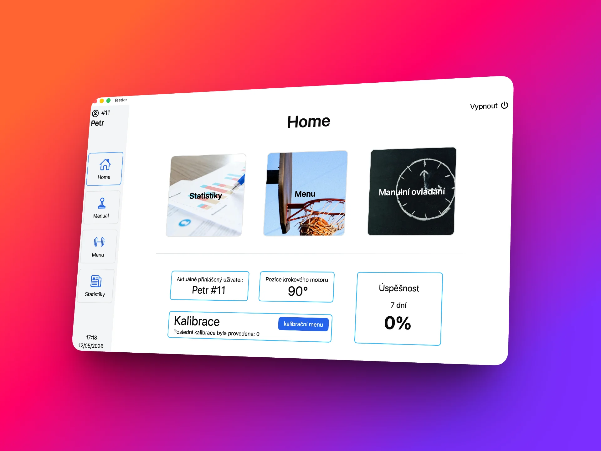
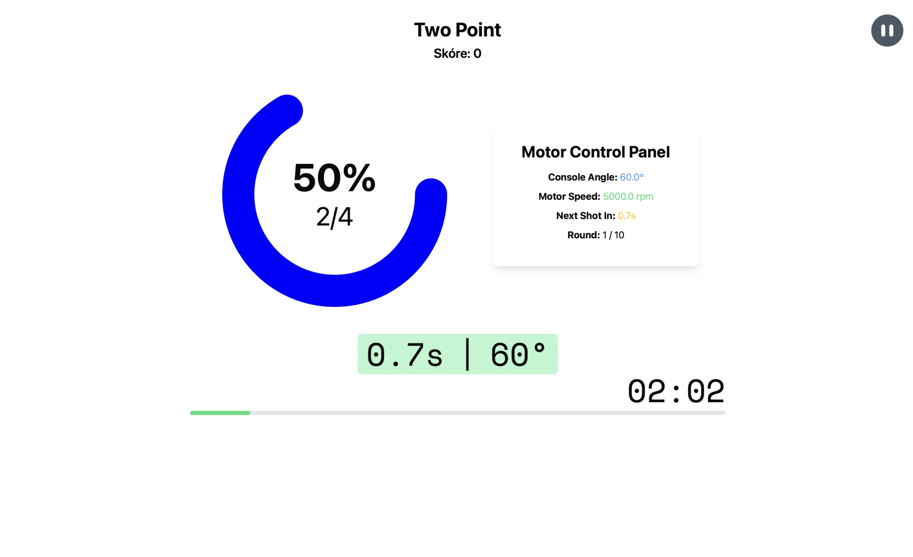
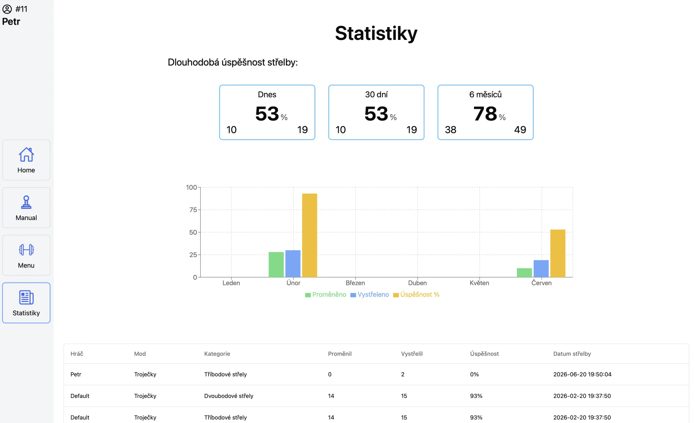

<h1 align="center">Feeder</h1>
<p align="center"><strong>A Tauri (React + Rust) touchscreen controller for a custom basketball feeding machine, built for a local basketball club.</strong></p>

<p align="center">
  <a href="#screenshots">Screenshots</a> &nbsp;&nbsp;·&nbsp;&nbsp;
  <a href="#system-architecture">System Architecture</a> &nbsp;&nbsp;·&nbsp;&nbsp;
  <a href="#key-features">Key Features</a> &nbsp;&nbsp;·&nbsp;&nbsp; 
  <a href="#tech-stack">Tech Stack</a> &nbsp;&nbsp;·&nbsp;&nbsp;
  <a href="#license">License</a>
</p>




---

## What it is

### App
**Feeder** is a React and Rust application that serves as the interactive control interface for an automated basketball passing machine. Built to make workouts more engaging and data-driven, the app lets players and coaches choose from pre-made or custom drills. It tracks shot performance in real time, logging makes and misses to a local SQLite database for easy data analysis.

---

### Hardware
The software runs on a Raspberry Pi 5 built directly into the machine's chassis. From the touchscreen, it controls hardware components to physical execution: driving stepper motors to adjust launching angles, triggering servos to handle ball dispensing, and reading laser sensors to detect incoming shots automatically.


<br>

## Screenshots

<table align="center">
  <tr>
    <td width="50%" align="center">
      
    </td>
    <td width="50%" align="center">
      
    </td>
    
  </tr>
</table>

## System Architecture

To ensure reliable, low-latency physical operation, the system is split across two controller boards:

- **Raspberry Pi 5 (The Brain)**: Runs the React/Tauri app on a touch display bolted to the machine. It manages the user interface, workout orchestration, SQLite historical logs, Bluetooth LE connectivity, and drives the stepper motor that rotates the launcher.
- **Arduino (The Real-Time Controller)**: Handles time-critical physical operations. It triggers the dual servos for dispensing and passing, and monitors three basket sensors. Offloading this from the Pi ensures that servo and sensor timings remain precise and unaffected by UI rendering or background database writes.

### Communication Protocol

The Pi and Arduino communicate over USB Serial (`115200` baud) using a lightweight command protocol:

- **Pi to Arduino**: Sends control instructions such as `SERVO1_STOP`/`SERVO1_RELEASE` (pass timing), `SERVO2_DISPENSE` (ball feed), and `RESET_SCORE`.
- **Arduino to Pi**: Broadcasts real-time events. The Arduino polls its analog sensors every 100ms and reports `SCORE:1` once a ball triggers the threshold, which the Pi's Tauri backend propagates to the React frontend as a `basket-score-updated` event.

The Arduino sketch and protocol documentation can be found in [`arduino/feeder_dual_servo_score`](./arduino/feeder_dual_servo_score).

For debugging serial communication without running the full Tauri application, a standalone Rust command-line tool is available in [`arduino-serial-tester`](./arduino-serial-tester):

```bash
cd arduino-serial-tester
cargo run -- --port /dev/ttyUSB0 --baud 115200
```

## Key Features

- **Drill Presets & Custom Routines**: Configure angle, distance, shot count, and passing interval dynamically.
- **Live Performance Feedback**: Displays real-time motor status, launcher angle, and a countdown timer for the next pass during active workouts.
- **Detailed History & Analytics**: Tracks historical makes, misses, and accuracy charts (today, 30 days, 6 months) for individual player profiles.
- **Wifi Sync**: Acts as a Wifi hotspot for remote workout control and workout data sync with FeederPocket mobile app.
- **Embedded Touch Keyboard**: Integrated React on-screen keyboard support designed for headless touchscreens without physical peripherals.

## Tech Stack

- **Frontend**: React 18, Tailwind CSS, Recharts (data visualization)
- **Desktop/Embedded Wrapper**: Tauri 2 (Rust backend)
- **Local Storage**: SQLite (via `tauri-plugin-sql`)
- **Hardware Integration**: Raspberry Pi GPIO control via `rppal`, USB Serial communication
- **Connectivity**: WiFi TCP Server + Bluetooth LE peripheral (`ble-peripheral-rust`) for mobile integration
- **Real-Time Controller**: Arduino (C++ / Arduino IDE)

## Running Locally

Because the project relies on specific Raspberry Pi GPIO, serial ports, and BLE hardware, running the full stack requires the physical machine. However, the user interface can be run in mock mode for UI development:

1. Clone the repository:
   ```bash
   git clone https://github.com/xxKuzi/Feeder.git
   cd Feeder
   ```
2. Install dependencies:
   ```bash
   npm install
   ```
3. Run the Tauri development server:
   ```bash
   npm run tauri dev
   ```

*Note: Serial communication calls to `/dev/ttyUSB0` will fail gracefully if no Arduino is connected, allowing you to develop and test UI features independently.*

## License

This repository is shared for portfolio and review purposes. No formal license is included; please contact the author if you wish to reuse or modify the source code.
